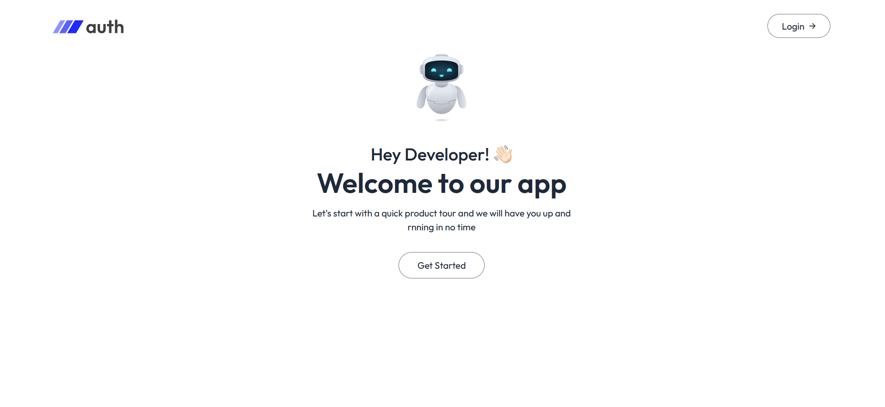
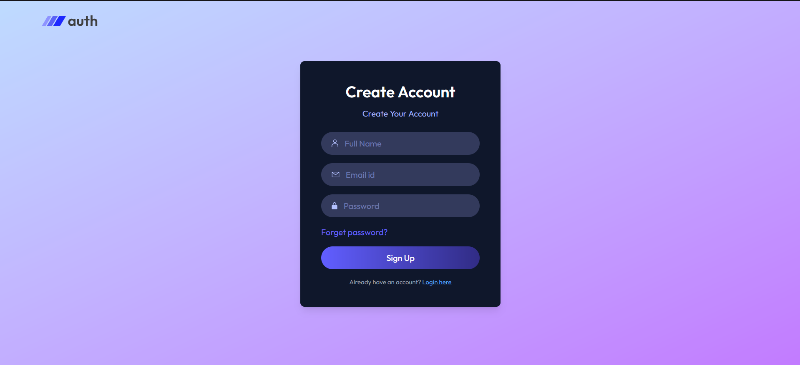
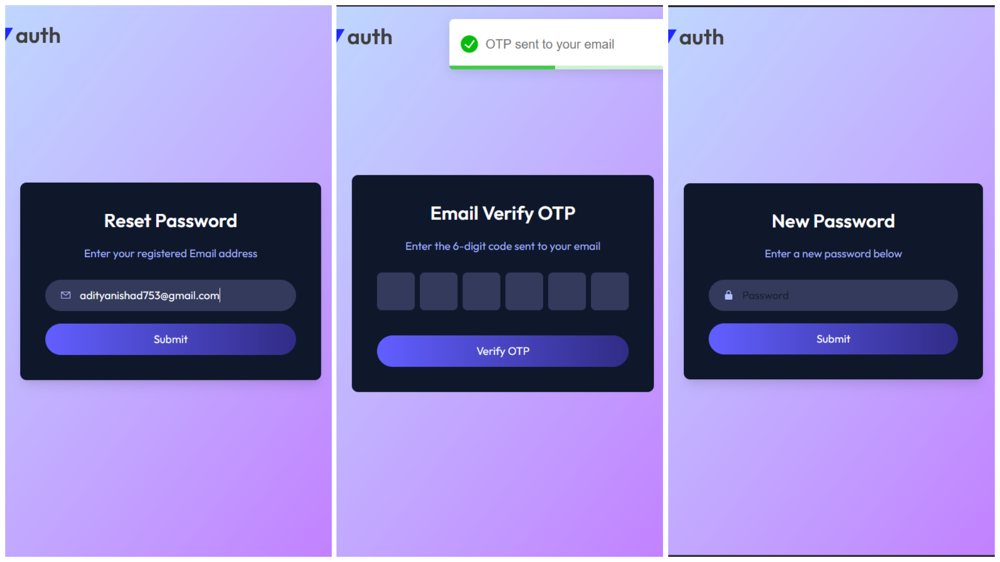

# MERN Authentication with OTP & Forgot Password

## 📌 Project Overview

This is a **MERN (MongoDB, Express.js, React.js, Node.js) Authentication System** that includes:

- User signup & login with **OTP verification**
- **Forgot password** functionality
- Secure authentication using **JWT tokens**
- Role-based access control (Admin/User)
- RESTful API structure
- Fully responsive frontend using **React & TailwindCSS**

---

## 🚀 Tech Stack

### **Frontend**:

- React.js
- TailwindCSS
- Axios (for API calls)

### **Backend**:

- Node.js
- Express.js
- MongoDB (Mongoose for schema management)
- JSON Web Tokens (JWT) for authentication
- bcrypt.js for password hashing
- Nodemailer for sending OTP emails

---

## 📌 Features

✅ User Registration with OTP verification\
✅ Secure Login with JWT\
✅ Forgot Password & Reset Password via Email\
✅ Role-based Authentication (Admin/User)\
✅ Protected Routes (Only authenticated users can access certain pages)\
✅ Session Expiry & Token Refresh\
✅ Responsive UI with TailwindCSS\
✅ RESTful API following best practices

---

## 🛠 Installation Guide

### **1️⃣ Clone the Repository**

```sh
git clone https://github.com/yourusername/mern-auth.git
cd mern-auth
```

### **2️⃣ Setup Environment Variables**

Create a **.env** file in the root directory and add the following:

```env
MONGO_URL=your_mongodb_connection_string
JWT_SECRET=your_jwt_secret_key
NODE_ENV='development'
SMPT_USER=your_email@example.com
SMPT_PASS=your_email_password
```

### **3️⃣ Install Dependencies**

#### Backend:

```sh
cd server
npm install
```

#### Frontend:

```sh
cd client
npm install
```

### **4️⃣ Start the Application**

#### Backend:

```sh
cd server
npm start
```

#### Frontend:

```sh
cd client
npm start
```

Now, your authentication system should be running locally! 🎉

---

## 📌 API Routes

### **Auth Routes** (`/api/auth`)

| Method | Endpoint         | Description                  |
| ------ | ---------------- | ---------------------------- |
| POST   | /register        | Register a new user with OTP |
| POST   | /verify-otp      | Verify OTP for registration  |
| POST   | /login           | Login user and get JWT token |
| POST   | /forgot-password | Send reset password link     |
| POST   | /reset-password  | Reset password using token   |
| GET    | /me              | Get logged-in user details   |

---

## 🛠 Deployment

### **Deploy Backend (Node.js & MongoDB) on Render/Vercel**

1. Push your code to GitHub.
2. Deploy the backend on **Render** or **Vercel**.
3. Connect your MongoDB database (MongoDB Atlas recommended).

### **Deploy Frontend (React) on Vercel/Netlify**

1. Push your React code to GitHub.
2. Deploy the frontend on **Vercel** or **Netlify**.

---

## 📌 Screenshots

### ✨ Signup Page with OTP Verification




### ✨ Forgot Password Page



---

## 🔥 Contributing

Feel free to contribute! Open a PR or issue if you have any suggestions.

---

## 📜 License

This project is licensed under the MIT License.

---

## 💡 Contact

- **GitHub:** [@Aditya07771]
- **Email:** [adityanishad753@gmail.com]
- **LinkedIn:** [https://www.linkedin.com/in/aditya-nishad-59a30b290/]

